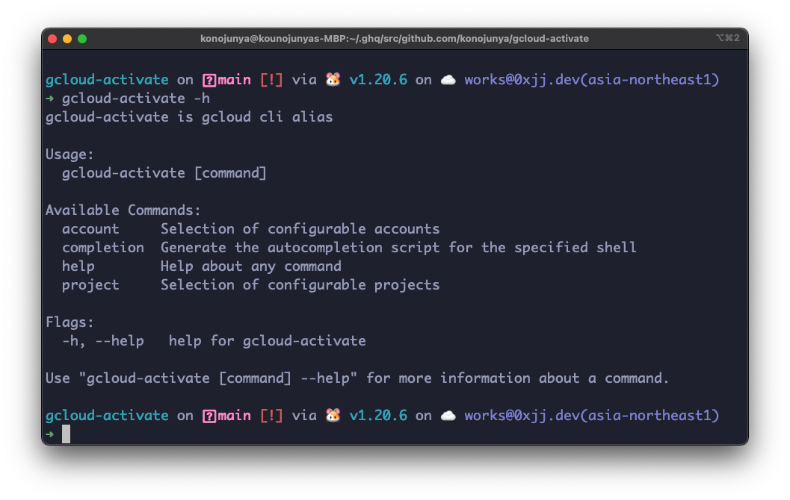

# gcloud-activate



Alias of gcloud cli

## Install

```shell
go install github.com/konojunya/gcloud-activate@latest
```

## Usage

You can add completions

```shell
gcloud-activate completion
```

Supports zsh, fish, powershell and bash.

### Info

```shell
gcloud-activate
```

### Account

```shell
gcloud-activate account // select account
or
gcloud-activate account --list // print accounts
```

### Project

```shell
gcloud-activate project // select project
or
gcloud-activate project --list // print projects
```
